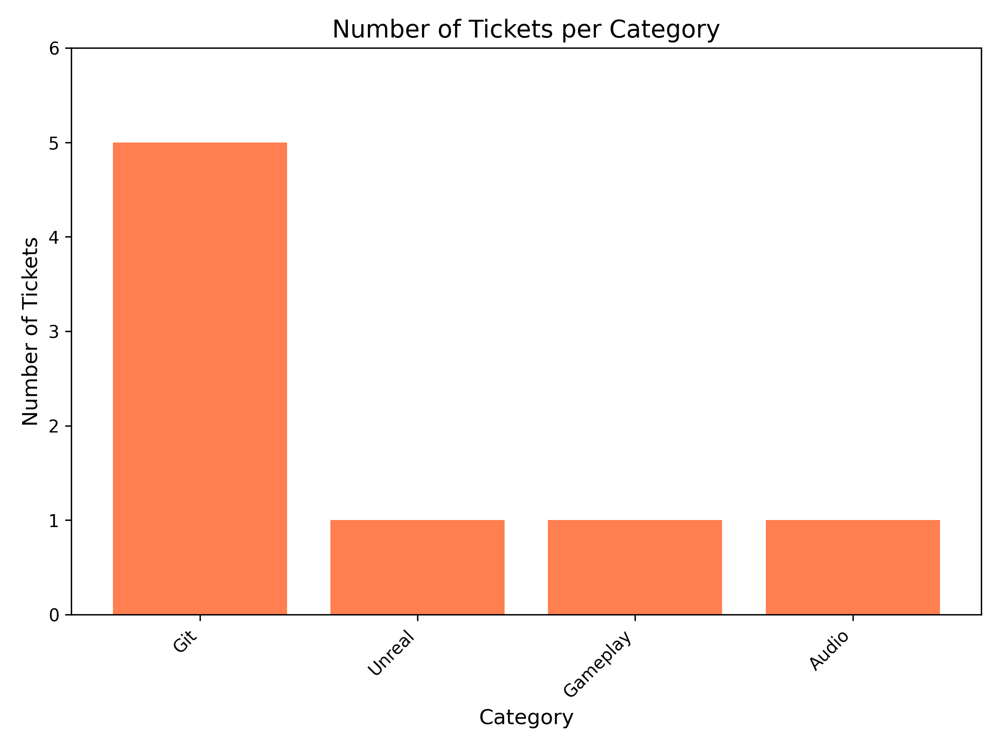
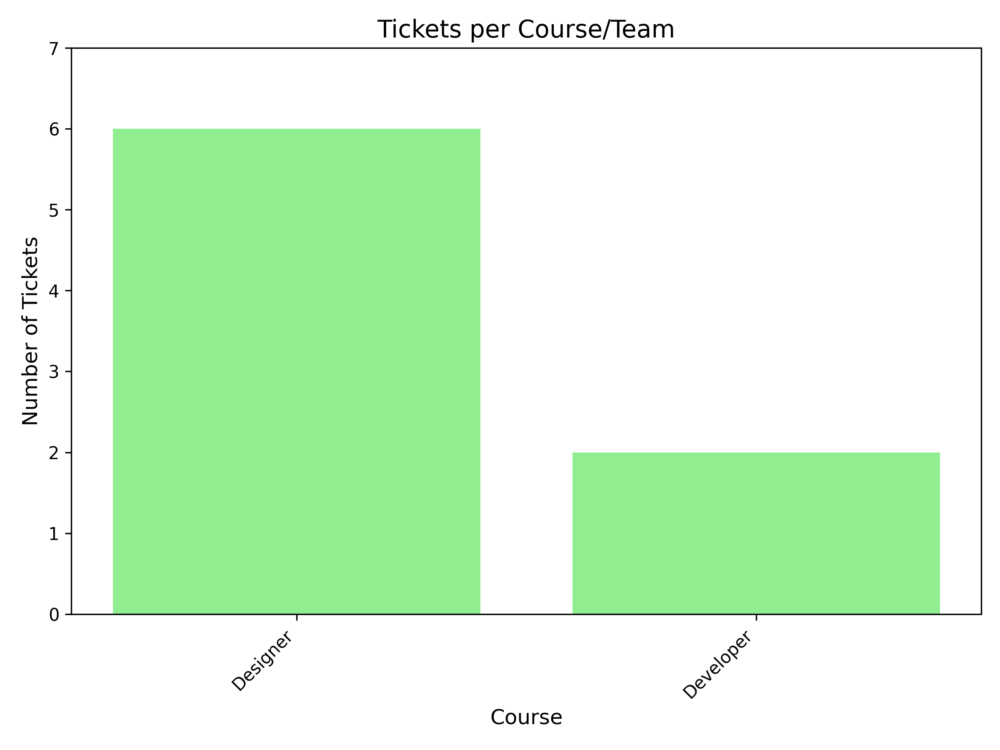
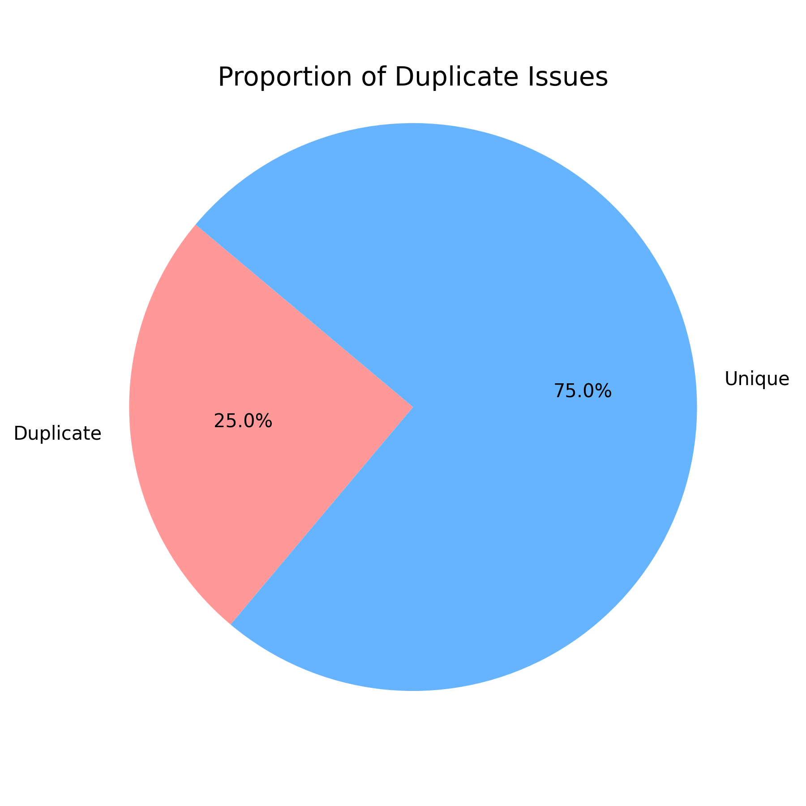
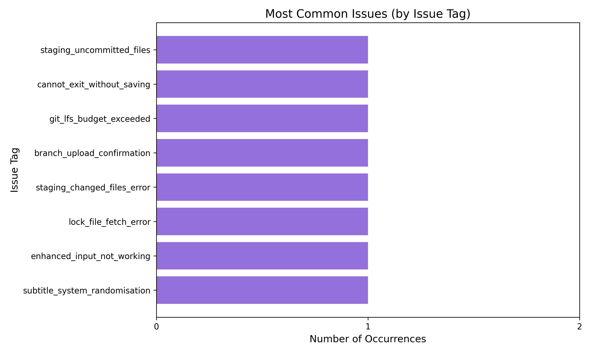

# Discord Ticket Bot Dataset Analysis

**Unit Name:** Tools and Production

**Student Name:** Zoe Efstathiou  

**Student ID:** 2423029 

## Introduction
This report provides a quantitative analysis of issues reported via the Discord ticket bot. The analysis aims to identify the most common problems encountered by team members (designers and developers) to help prioritize support and improve workflows.

## Data Categorisation Methodology
The ticket data was categorised using the existing fields in the dataset:
- **Category:** Broad areas of concern such as Git, Unreal Engine, Gameplay, and Audio.
- **Course/Team:** Divided between `Designer` and `Developer` roles.
- **Issue Tag:** Specific identifying tags for each problem (e.g., `staging_changed_files_error`).
- **Duplicate Status:** Whether the ticket was flagged as a duplicate (`true` or `false`).

## Summary Tables

### Ticket Distribution by Category
| Category | Number of Tickets |
| :--- | :--- |
| Git | 5 |
| Unreal | 1 |
| Gameplay | 1 |
| Audio | 1 |

### Ticket Distribution by Course/Team
| Course/Team | Number of Tickets |
| :--- | :--- |
| Designer | 6 |
| Developer | 2 |

### Ticket Duplication Status
| Status | Number of Tickets |
| :--- | :--- |
| Unique | 6 |
| Duplicate | 2 |

## Graph Analysis

### 1. Number of Tickets per Category

**Analysis:** The graph clearly demonstrates that version control (Git) is the most significant source of friction for the team, accounting for 5 out of 8 reported issues. Other areas like Unreal Engine, Gameplay, and Audio each have only a single reported issue, suggesting they are either better understood by the team or encountered less frequently.

### 2. Tickets per Course/Team

**Analysis:** Designers reported the vast majority of issues (6 tickets) compared to Developers (2 tickets). This disparity likely indicates that designers face more technical hurdles, particularly with tools like Git and Unreal Engine setups, requiring additional guidance or more streamlined workflows tailored to their role.

### 3. Duplicate / Repeat Issues

**Analysis:** Of the recorded tickets, 25.0% (2 tickets) were flagged as duplicates, while 75.0% (6 tickets) were unique. The presence of duplicate tickets suggests that certain problems (specifically, Git staging and lock file errors) are being encountered repeatedly by different or the same users. This reinforces the need for centralized documentation or fixes for these recurrent issues to reduce repetitive queries.

### 4. Most Common Issues (by Issue Tag)

**Analysis:** This graph visualizes the distribution of specific `issue_tags`. While each individual issue tag only appeared once in this dataset sample, reviewing them reveals that version control operations, such as lock file fetch errors, branch upload confirmations, and Git LFS budget extensions are the primary blockers. No single specific task stands out on its own purely by frequency, but the thematic grouping aligns perfectly with the heavy Git category concentration.

## Conclusion
The analysis suggests that the team's primary roadblock is version control, specifically Git-related workflows and errors. Furthermore, the designer team encounters these issues at a significantly higher rate than developers. To reduce the volume of support tickets and improve productivity, it is recommended that the team establishes comprehensive Git guidelines or provides supplementary training tailored specifically to the designer workflow.
